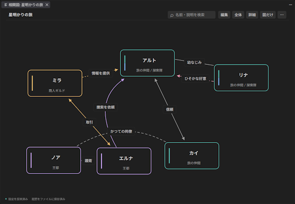
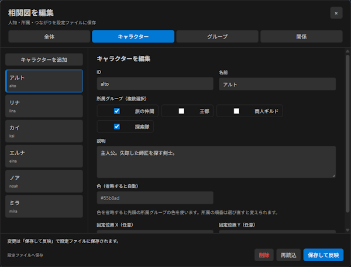
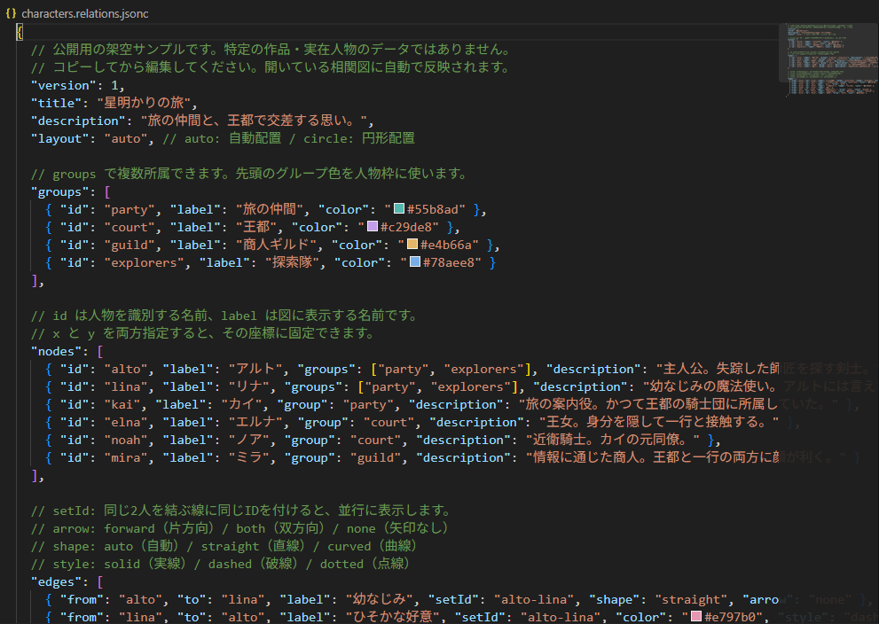

# Character Relationship Chart

- Concept, Direction & Product Ownership: Satsuki Thyme
- AI-assisted Engineering: ChatGPT by OpenAI

人物・グループ・関係をJSON / JSONCで管理し、相関図を表示・編集する **デスクトップ版VS Code拡張**です。小説の登場人物、組織、アイデアのつながりを整理できます。

編集・保存に対応するVS Code版に加え、GUI編集・設定ファイルのダウンロードと、対応環境での明示的な直接保存に対応するWeb版を提供します。Web版VS Code用の拡張とは別です。

## Web版

`dist/character-relationship-chart-web-stage8-2026-10-10.zip` をすべて展開し、`index.html` をブラウザで開いてください。起動時にサンプルが表示されます。**設定を開く**または画面へのドロップで、UTF-8のJSONC / JSONを読み込めます。任意で対応する `.view.json` も読み込めます。

人物・グループ・関係・全体設定を共通GUIで編集できます。**編集 → 反映 → 編集画面を閉じる → 設定をダウンロード**で、元の名前を基本とするUTF-8の `.jsonc` / `.json` を取得できます。通常の読込・ドロップはダウンロード方式を維持します。対応環境では **直接保存用に開く → 編集 → 反映 → 編集画面を閉じる → 設定を保存** で元ファイルを更新できます。未反映の入力は暗黙に反映しません。人物・グループのID変更は参照へ追従し、人物削除時には接続する関係も削除します。変更対象外のコメント・整形を可能な範囲で保持します。

検索・詳細・拡大縮小・ドラッグを維持し、**表示データをダウンロード**で配置・倍率・表示位置・配置方式・詳細欄・図だけ表示をUTF-8の `<本体ファイル名>.view.json` として出力できます。設定本体も別に保存し、両方を選んで再読込すると復元します。保存時は手動移動した人物だけでなく、自動配置を含む全人物の描画座標を保持します。対応環境では、既存表示データを **表示データを直接保存用に開く** で選び、変更後に **表示データを保存** で更新できます。**表示データの新規保存先を選ぶ** は明示的に選択した新規／空ファイルだけを使い、中身のある既存ファイルを上書きしません。設定ハンドルから隣のファイルを探索しません。設定と表示データの保存状態は独立です。ページ内の「取り消し」「やり直し」で反映済み編集と表示を戻せます。「画像」欄の **SVGをダウンロード** で図全体を出力できます。ブラウザ永続保存はありません。保存／ダウンロードしない変更は画面を閉じると失われます。直接保存は元ファイルを基準バイト列と比較し、外部変更・確認不能時には停止します。競合・失敗で図や入力を消さず、ダウンロードで退避できます。書込完了後の再読込が一致し、現在の反映済み内容も一致した場合だけ設定を保存済みにします。ダウンロード開始後も保存完了は判定できないため、ブラウザの保存先を確認してください。データを外部に送信せず、利用にVS Code・Node.js・Webサーバー・ネット接続は不要です。詳しくは [Web版の使い方](web/README-ja.md)。このWeb用説明書はWeb配布物に同梱し、VSIXには含めません。

**第5段階は完了しました（2026-09-28 JST）。** 自動試験に加え、利用者の実機で直接保存・再読込と、外部変更時の競合警告・保存停止を確認しました。Linux Headless Chromiumでの書込拒否の記録は別の検証結果として残し、利用者のOS・ブラウザ版数や未実施の個別試験を推測で補っていません。直接保存は `showOpenFilePicker` と書込APIを利用できる安全なコンテキストが必要です。APIの非対応・拒否時はダウンロード方式を使えます。外部アプリとの完全な同時書込み排除は保証せず、保存操作中の他アプリでの書込みは避けてください。[実機確認手順](docs/STAGE5_ACCEPTANCE.md) と [検証記録](TESTING.md) を参照してください。

**第6段階は完了しました（2026-10-02 JST）。** Webの報告済み3項目とVS Code追加3項目のokを既存自動検証と照合し、追加試験が今回の修正版VSIXの導入・Windowリロード後の結果であることを利用者に確認しました。 [第6段階の確認手順](docs/STAGE6_ACCEPTANCE.md) を参照してください。第1〜6段階の完了判定を維持します。

**第7段階は2026-10-09 JSTに正式完了しました。** Web版のUndo/Redoは設定本文と配置・倍率・表示状態を一操作として戻し、人物IDの参照・JSONCコメントも往復します。未反映フォームと保存中は履歴を止め、保存先・確認済み保存内容・競合停止は巻き戻しません。履歴はページ内最大100操作／概算16MiBで、正常読込・ページ終了により消えます。**ローカル下書き保存は「当面採用しない」**と決定しました。Web受入1〜5・VS Code受入6の実機報告と、指定第7段階VSIX導入・Windowリロードの追加報告を照合済みです。配布物SHA-256の一致を確認していますが、インストール先ハッシュは未測定です。[受入確認](docs/STAGE7_ACCEPTANCE.md)・[正式完了記録](change-details/character-relationship-chart-stage7-completed-2026-10-09-ja.md)・[下書き設計（履歴）](docs/STAGE7_DRAFT_DESIGN.md)を参照してください。

**第8段階は実装・自動検証済み、実機確認待ち（2026-10-10 JST）です。** SVG出力と出力操作を整備しました。[受入確認](docs/STAGE8_ACCEPTANCE.md)と[記入票](docs/STAGE8_PHYSICAL_DEVICE_CHECK.md)を参照してください。第1〜7段階の完了は維持します。

ソースから作る場合は `npm ci` → `npm run build:web` を実行し、`dist/web/index.html` を開きます。

## VS Code版の主な機能

- 人物、グループ、関係、タイトルをGUIで追加・編集・削除。
- キャラクターの複数グループ所属、所属色の表示・検索。
- 片方向／双方向／矢印なし、実線／破線／点線、直線／曲線／自動の関係線。
- 同じ二人の複数の関係、並行線セット、自分自身への関係。
- 自動配置・円形配置、ドラッグ、拡大縮小、図だけ表示、検索、詳細表示。
- テキスト編集中の自動反映、設定エラー表示、SVG画像の保存。
- 配置・倍率などを設定ファイルの隣の `.view.json` に保存して共有。

拡張自身はAPIキー・外部サービス・Dropboxを必要とせず、人物データをネット送信しません。依存の導入にはネット接続が必要です。VS Code本体や他の拡張の通信は別です。

## 画面例





## 必要環境

| 用途 | 必要なもの |
| --- | --- |
| 作成済みVSIXを利用 | デスクトップ版VS Code 1.85以降 |
| 作成済みWeb版を利用 | JavaScript・FileReader・ResizeObserverに対応したデスクトップブラウザ |
| ソースから利用・改造 | 上記に加えNode.js 22以降とnpm。Gitはクローンする場合のみ必要 |

VSIXはVS Code用のインストールファイルです。利用時はNode.jsを別途インストールする必要はありません。

## GitHubから入手して使う

ソースからVSIXを作成する方法です。WindowsではVS Code内のターミナル、PowerShellなどで実行できます。

1. このリポジトリの **Code → Download ZIP** で取得して展開します。Gitを使う場合は次のとおりです。

   ```sh
   git clone https://github.com/satsuki-thyme/character-relationship-chart.git
   cd character-relationship-chart
   ```

2. ZIPの場合も、展開先の `package.json` があるフォルダでターミナルを開き、実行します。

   ```sh
   npm ci
   npm run check
   npm test
   npm run package
   ```

3. 同じフォルダに `character-relationship-chart.vsix` が生成されます。コンパイルやWebサーバーの起動は不要です。
4. VS Codeの拡張機能画面（Windows／Linux: `Ctrl+Shift+X`）で `…` → **VSIXからのインストール** を選び、このファイルを指定します。再読み込みを求められたら実行します。
5. コマンドパレット（Windows／Linux: `Ctrl+Shift+P`、macOS: `Cmd+Shift+P`）で **Character Relationship Chart: サンプル設定を作成** を実行します。
6. 自分の作業用フォルダに保存すると、設定と相関図が開きます。

VSIXの作成・手動インストールは [VS Code公式の配布手順](https://code.visualstudio.com/api/working-with-extensions/publishing-extension#packaging-extensions) に基づいています。Marketplaceでの公開やGitHub ReleasesへのVSIX添付は、この手順の前提にしていません。

## 基本的な使い方

- 作成済みの `.jsonc` ファイルを右クリックし、**相関図を表示**を選びます。`登場人物.jsonc` のように名前は自由です。
- 従来の `*.relations.json` にも右クリックメニューを表示します。それ以外の `.json` はコマンドパレットの **Character Relationship Chart: 相関図を表示**から選びます。
- 設定をテキストで編集すると、未保存の内容も約0.2秒後に表示へ反映します。
- 人物をドラッグして移動。ドラッグでは詳細欄を開かず、表示中の詳細・選択も維持します。空白をドラッグして図を移動。ホイールで拡大縮小し、**全体**で図を収めます。
- 人物や線・ラベルをクリックすると説明を表示します。**詳細**で詳細欄、**図だけ**で操作欄を開閉できます。
- **⋯**から配置方式の変更、配置リセット、表示データの保存・再読込、SVG保存を選べます。
- SVG保存は図全体を出力します。検索や選択による薄い表示は含めません。設定エラーがある間は出力を止めます。

サンプルは [examples/characters.relations.jsonc](examples/characters.relations.jsonc)。架空の6人・4グループ・8関係で、複数所属、直線／曲線、並行線、3種類の線、双方向関係を試せます。自分の作品はサンプルを別フォルダへコピーして作ってください。

## GUIで編集

**編集**を押し、「全体」「キャラクター」「グループ」「関係」のタブを選びます。対象を選択するか追加し、**保存して反映**で設定ファイルへ保存します。

- 所属はチェックボックスで複数選べます。最初に選んだグループの色が人物枠の色になります。人物自身の色指定があれば優先します。
- 人物IDを変えると関係の参照と保存済みのドラッグ位置が追従します。グループIDを変えると所属の参照が追従します。
- 人物の削除では接続する関係も削除します。グループの削除では所属だけ解除し、人物は残します。削除前に画面で確認できます。
- JSONCの変更しない箇所のコメントをできるだけ保持します。削除・置換した項目のコメントは失われることがあります。
- 他の場所で設定が変わるとGUI保存を止め、入力を残します。内容を確認して **再読込**してください。
- 元に戻す場合は、設定をテキストエディターで開き、VS Codeの **元に戻す**を実行して保存します。

この拡張は設定・配置・SVGの保存時にバックアップを自動作成しません。必要な履歴はGitや別のバックアップ方法で管理してください。

## データと表示設定

最小例をUTF-8の `.jsonc` として保存します。

```jsonc
{
  "title": "人物相関図",
  "nodes": [
    { "id": "hero", "label": "主人公" },
    { "id": "friend", "label": "親友" }
  ],
  "edges": [
    { "from": "hero", "to": "friend", "label": "信頼", "arrow": "both" }
  ]
}
```

| ファイル | 役割 |
| --- | --- |
| `登場人物.jsonc` | 人物・所属・関係・色などの本体データ |
| `登場人物.jsonc.view.json` | ドラッグ位置・倍率・図の表示位置・詳細欄・図だけ表示 |

VS Code版の `.view.json` は表示を操作した約0.7秒後に自動保存します。Web版は明示保存／ダウンロードを使います。開いただけでは作りません。なくても図を表示できます。配置も渡したいときは両方を共有してください。設定の絶対パスは保存しません。

ファイルを手動で移動・改名する場合は両方を一緒に扱います。VS Codeのエクスプローラーで表示中の設定を改名した場合は、移動先に同名ファイルがなければ表示ファイルも追従します。外部変更・未保存編集・不正な表示データを検出すると上書きを止めます。

詳細は [データ仕様](docs/DATA_FORMAT.md)。各項目の型・初期値・制限、複数所属、並行線、表示座標の意味を説明しています。AIにデータ作成を頼むときも、この仕様とサンプルを渡せます。

入力補完とSchema検証は `*.relations.jsonc` / `*.relations.json` で自動的に有効になります。任意名の `.jsonc` は表示できますが、補完は別途 `$schema` またはVS Codeの `json.schemas` で関連付けます。詳しくはデータ仕様を参照してください。

## 既知の制限・困ったとき

- 上限は人物200、関係1000、グループ50。ラベルはすべての関係線より前面に表示し、SVG保存でも同じ順序を保ちます。複雑な図ではラベル同士や人物枠と重なる場合があります。ドラッグや固定座標で調整してください。
- `straight` は途中の人物を迂回しません。自分自身への関係では `auto` または `curved` を使います。
- `.view.json` は通常のJSONです。コメント・末尾カンマは書けません。
- 設定エラーの間は直前の有効な図を表示します。エラー表示とVS Codeの「問題」パネルを確認してください。
- 新規の未保存ファイルは先に名前を付けて保存します。画面外にある図は **全体**、配置を戻す場合は **⋯ → 配置をリセット**を使います。
- VS Code再起動時に新しい相関図タブは自動復元しません。設定から開き直すと、保存した配置を読み込みます。
- 書き込み権限のない場所では保存できません。GUIの保存失敗時はテキストエディターに残った未保存内容を確認してください。
- 拡張はデスクトップ版VS Code向けです。独立Web版は上記の編集・ダウンロード方式を使い、Web版VS Code用拡張・共同編集は提供していません。OS別の実機確認状況は [TESTING.md](TESTING.md) を参照してください。

## 拡張機能の識別子と旧版からの切り替え

表示名は **Character Relationship Chart**、拡張機能IDは `local.character-relationship-chart` です。コマンドIDは `characterRelationshipChart.open`、`characterRelationshipChart.createSample`、`characterRelationshipChart.migrateLegacy` です。

公開用のバージョンは `0.1.0` です。公開前の開発版から版数を振り直しています。既存の設定ファイルと `.view.json` をそのまま使えます。

1. 開発版で編集中の設定・配置を保存し、設定ファイルと隣の `.view.json` を確認します。内部保存だけに残っている配置は、表示データのファイル保存に対応した旧IDの開発版で移行してから切り替えます。
2. 相関図タブを閉じます。現在の拡張IDと異なる開発版を使っている場合は、その拡張を無効化します。同じIDで版数の大きい開発版が入っている場合は、いったんアンインストールします。
3. `0.1.0` のVSIXをインストールし、設定ファイルから **Character Relationship Chart: 相関図を表示** で開き直します。
4. 独自のキーバインドやコマンド呼び出しを設定している場合は、上記のコマンドIDを使っていることを確認します。異なるIDの開発版は、新しい版で表示・保存を確認できたらアンインストールできます。

旧ID側の内部保存データや開いたタブは、新IDから自動で引き継げません。`旧版データをファイルへ移行` コマンドが対象にするのは、現在の拡張IDの内部保存領域です。ファイル保存に成功した記録だけ削除し、失敗時は元の記録を残します。

解析・検証・JSONC編集・表示データ・描画計算は `packages/core/` に集約し、VS Code連携は `src/extension.js` と `src/storage.js` に分かれています。UIはホストの提供機能に応じて操作を表示します。VS Code固有の通信・起動・テーマ連携は `media/vscode-*`、Webの読込・メモリー編集・保存状態は `web/host.js`、ファイルハンドル・権限・競合比較・書込は `web/file-access.js` が担当します。配布物はVSIXと静的Web版ZIPです。構成とWeb版への転用状況は [開発ガイド](docs/DEVELOPMENT.md) と [設計](docs/architecture.md) にあります。

## 開発・ライセンス

ソースをVS Codeで開き、`npm ci` 後に **F5** で開発用の別ウィンドウを起動できます。

- [開発ガイド](docs/DEVELOPMENT.md)
- [公開・配布手順](docs/RELEASE.md)
- [検証結果と実機確認手順](TESTING.md)
- [更新履歴](CHANGELOG.md)

本プロジェクトは [MIT License](LICENSE) です。利用・改変・再配布ができ、配布時にはライセンスと著作権表示を保持してください。プロジェクト自身の著作権表示は `Character Relationship Chart contributors` です。
実行時依存 `jsonc-parser` 3.3.1もMITです。[第三者ライセンス](THIRD_PARTY_NOTICES.md) を参照してください。


## 第6段階・VS Code版の追加修正（2026-10-01 JST）

表示データの直接保存後、表示ファイルを開いたり相関図パネルを切り替えたりすると、人物同士の配置が変わる不具合を修正しました。同じ設定の再表示では現在の配置を保ち、設定変更・固定座標・人物ID変更・配置切替・リセットは従来どおり使えます。

配布物は `dist/character-relationship-chart-stage6-vscode-redisplay-fix-2026-10-01.vsix`。同じ0.1.0の再配布なので、このファイルからインストールし、開いていた相関図を閉じてからVS Codeの「Developer: Reload Window」を実行してください。今回の `media/main.js` のSHA-256は `1bad960562dc60ce8d5ca1b413bfda83f0ceaec6d9e460e07cd563cdd68ad3a9` です。導入確認と短い実機手順は [追加修正記録](change-details/character-relationship-chart-stage6-vscode-redisplay-fix-2026-10-01-ja.md)、記入先は `docs/STAGE6_PHYSICAL_DEVICE_CHECK.md` の末尾です。2026-10-02 JSTに追加3項目のokを原ログと照合しました。その後、指定修正版VSIXの導入・Windowリロード後の試験だったと利用者が確認し、第6段階を完了と記録しました。ここに記載したハッシュは導入判別の案内であり、利用者環境での実測値ではありません。最新の判定は [受入資料](docs/STAGE6_ACCEPTANCE.md) を参照してください。
